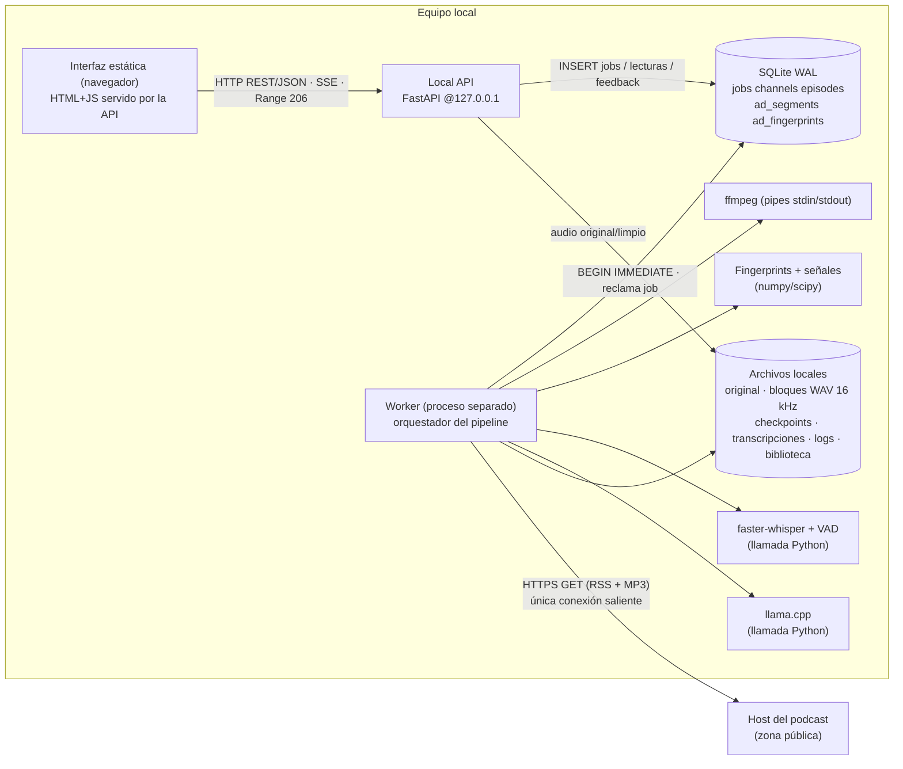

# Arquitectura y conexiones (diagrama E-1 adaptado)

| Conexión | Protocolo | Notas |
|---|---|---|
| Navegador → API | HTTP REST/JSON, SSE (`/jobs/{id}/events`), Range 206 (`/episodes/{id}/audio/{original,clean}`) | solo 127.0.0.1 |
| API ↔ Worker | **solo** tabla `jobs` en SQLite | el worker puede caer sin afectar API/interfaz; el supervisor (`python -m podcleany start`) lo reinicia y los jobs `running` sin latido se re-encolan |
| Worker → ffmpeg | pipes stdin/stdout, bloques de 10 min (configurable) | el episodio completo nunca está en RAM |
| Worker → host | HTTPS GET | única salida de red en operación |
| Worker → modelos | llamadas Python en proceso | `local_files_only` en Whisper: no descarga en operación |

## Mapa de módulos
`config` · `db` (esquema, migraciones, cola) · `feeds` (RSS/descarga) · `audio` (ffmpeg, bloques, render) · `fingerprint` · `signals` · `models` (Whisper/llama.cpp/respaldo) · `decision` (dos umbrales) · `pipeline` (pasos 4-9, render) · `worker` · `api` (pasos 1-2, 10-11) · `static/index.html` · `report` (Informe B).

## Pasos E.6 → código
1 Enviar `static/index.html` → `api.submit` · 2 Encolar `api.submit` (202, dedupe por índice único parcial) · 3 Reclamar `db.claim_job` (BEGIN IMMEDIATE) · 4 Descargar `feeds.download` · 5 Normalizar `audio.normalize_to_blocks` · 6 Comparar `fingerprint.match` + `signals` · 7 Resolver `models` + `decision.llm_candidates` solo en regiones sin huella · 8 Decidir y cortar `decision.combine/decide`, `audio.render_clean` · 9 Persistir `pipeline.process` · 10 Informar y reproducir `api.job_events`, `api.range_response` + descarga · 11 Aprender `api.learn` / `edit_segment` / `add_missed_ad` / `protect`.

## Decisión de dos umbrales
Candidatos del LLM: `score = 0.70·p_LLM + 0.10·bordes en silencio + 0.10·salto de volumen + 0.10·música`. `score ≥ umbral alto` → eliminar; entre umbrales → **revisión del usuario** (no se quita hasta confirmar); `< umbral bajo` → descartar. Huella conocida → eliminar (evidencia determinista); huella protegida → veto. Valores de umbrales **provisionales** (ver PENDIENTES).
